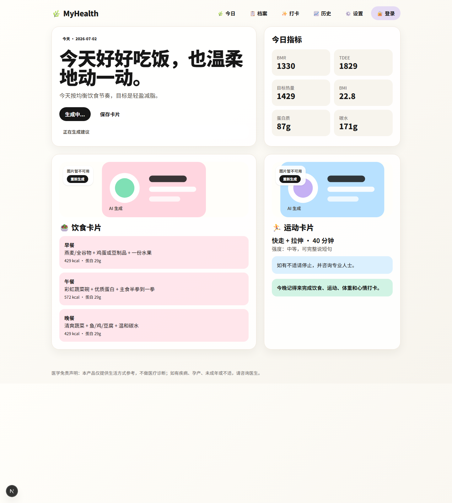
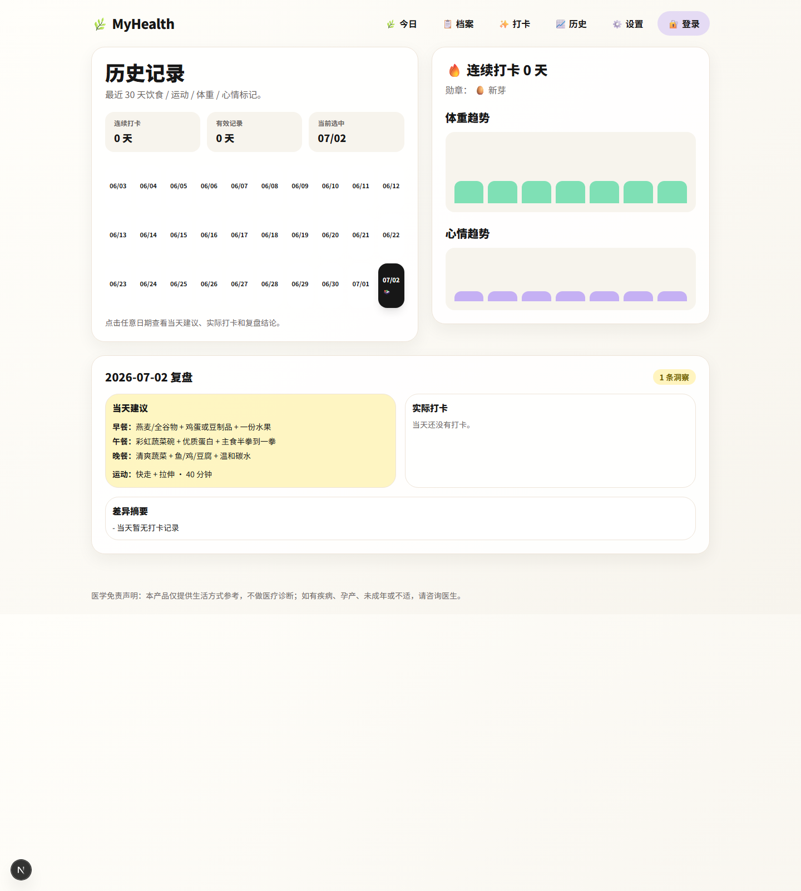
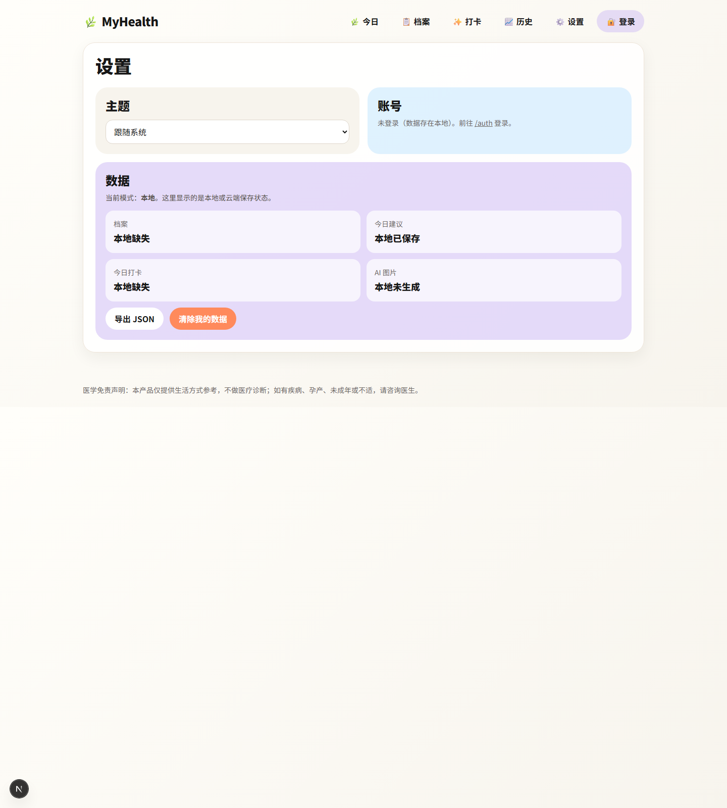

# MyHealth 项目介绍

## 产品简介

MyHealth 是一个面向日常健康管理的 Web 应用，围绕“今日建议 - 历史回顾 - 数据设置”三条主线展开。它帮助用户查看当天的饮食与运动建议，记录打卡与体重变化，并在本地与云端之间同步健康数据。

这个项目的定位不是单纯的展示页，而是一个可以持续使用的健康管理工具：用户可以每天打开首页看建议，进入历史页复盘近 30 天趋势，再到设置页查看数据状态、导出记录或清理本地数据。

## 主要功能

### 今日建议

- 展示当天的核心健康指标，包括 BMR、TDEE、目标热量、BMI、蛋白质和碳水等。
- 生成当天的饮食建议和运动建议，方便用户快速执行。
- 支持保存建议卡片，便于后续回看或分享。
- 提供图片卡片展示能力，用于承载更直观的建议内容。

### 历史回顾

- 按日期查看最近 30 天的健康记录。
- 展示连续打卡、有效记录等概览信息。
- 支持查看体重趋势和心情趋势，帮助用户理解长期变化。
- 对当天建议与实际打卡进行对照，便于复盘偏差。

### 设置与数据管理

- 支持主题切换。
- 展示账号状态和当前数据存储模式。
- 支持导出 JSON 数据。
- 支持清除本地数据，便于重置或迁移。

### 账号与同步

- 提供登录与回调流程。
- 兼容本地存储与 Supabase 云端同步。
- 通过数据仓库抽象层组织本地与云端数据源，便于后续扩展。

## 截图

以下截图为当前项目运行效果，均来自实际页面。

### 首页

### 历史记录页

### 设置页

## 技术栈

- **前端框架**：Next.js
- **视图层**：React
- **语言**：TypeScript
- **样式方案**：Tailwind CSS
- **表单与校验**：react-hook-form、zod
- **后端与同步**：Supabase（`@supabase/ssr`、`@supabase/supabase-js`）
- **图片与导出**：html2canvas
- **测试与校验**：Playwright、Vitest
- **工程化**：ESLint、Next.js App Router

## 项目结构简述

- `src/app`：页面与路由，包括首页、历史、设置、登录、回调和 API。
- `src/components`：通用组件与页面插图。
- `src/domain`：健康数据、建议与历史回顾相关的领域逻辑。
- `src/lib/repo`：本地存储与 Supabase 数据层实现。
- `src/lib/supabase`：Supabase 客户端、服务端与存储工具。

## 说明

当前项目更偏向“可持续使用的健康记录工具”，而不是一次性的展示型页面。后续如果继续扩展，比较自然的方向是：更细的健康指标分析、更多图表、个性化建议，以及更完整的云端同步和账号体系。
